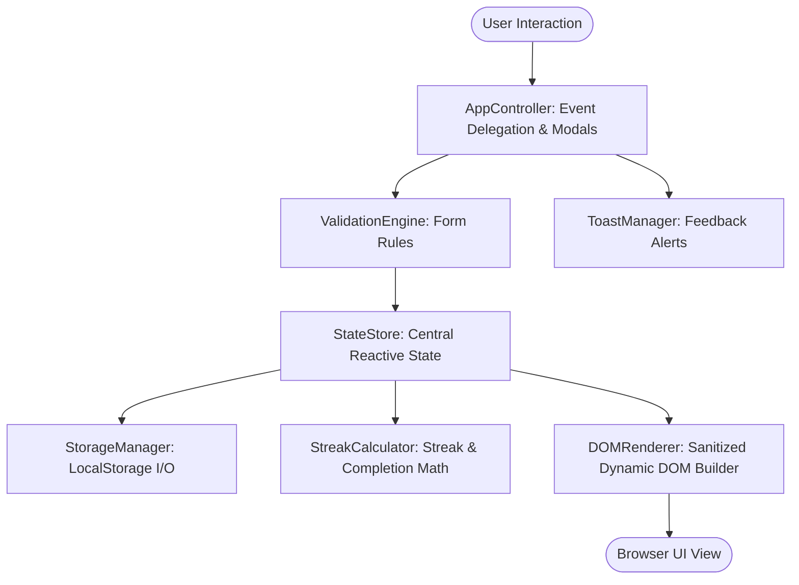

# HabitPulse — Vanilla JavaScript Habit Tracker PWA

A high-performance, single-page Progressive Web App (PWA) built strictly using **vanilla JavaScript (ES6+)**, **HTML5**, and **CSS3**. Zero external UI frameworks, zero build steps, and zero runtime dependencies.

---

## 🌟 Key Features

- **Dynamic Form Validation & DOM Manipulation**: Accessible modal dialog with real-time inline validation rules, error messaging, and non-destructive dynamic DOM re-rendering.
- **Persistent LocalStorage State Management**: Automatic local persistence, JSON schema validation, fallback error handling, and initial seed dataset generation.
- **Intelligent Streak Engine**: Calculates continuous active streaks, handles "today vs. yesterday" grace-period edge cases, tracks all-time longest streaks, and calculates 30-day consistency rates.
- **Interactive 7-Day & 30-Day Heatmap Tracking**: Clickable 7-day mini-week bubbles and a full 30-day activity matrix (similar to GitHub contribution heatmaps).
- **Multi-dimensional Filtering & Instant Search**: Filter by category (*Health*, *Work*, *Personal*, *Mindfulness*, *Fitness*), completion status (*All*, *Pending*, *Completed*), and search query with real-time debounce.
- **Rich Responsive Glassmorphism Design**: CSS Custom Properties design system with fluid typography, dark/light theme switching, animated SVG radial progress rings, and mobile-first layouts.

---

## 📁 Project Architecture & File Structure

```
├── index.html     # Semantic HTML5 markup, SVG assets, and modal structures
├── style.css      # CSS3 design system, theme variables, glassmorphism, responsive grid
├── app.js         # Modular JavaScript (State store, Streak engine, Storage, DOM Renderer)
└── README.md      # Technical architecture and logic documentation
```

---

## 🧠 JavaScript Logic & Architectural Breakdown

The JavaScript codebase in `app.js` is structured into decoupled, single-responsibility modules:



### 1. `StorageManager` (Data Persistence & Hydration)
- **Key Storage Keys**:
  - `'habitpulse_habits_v1'`: Serialized array of habit objects.
  - `'habitpulse_theme_v1'`: UI theme preference string (`'dark'` or `'light'`).
- **Data Model Schema**:
  ```json
  {
    "id": "habit_1723901234567_abc",
    "title": "Morning 20-Min Jog",
    "category": "Health",
    "frequency": "daily",
    "emoji": "🏃",
    "color": "#10b981",
    "notes": "Build stamina and boost morning energy.",
    "createdAt": "2026-08-01",
    "history": {
      "2026-08-16": true,
      "2026-08-17": true
    }
  }
  ```
- **Error Handling**: Wrapped in `try-catch` blocks to guard against corrupted JSON, disabled cookies/storage, or `QuotaExceededError`.
- **Seed Migration**: If storage is empty, realistic starter habits with existing streaks are pre-populated so the UI is immediately functional.

---

### 2. `DateUtils` (Timezone-Safe Normalization)
All dates are normalized into `YYYY-MM-DD` strings using local system time getters (`getFullYear()`, `getMonth() + 1`, `getDate()`) to prevent timezone shifting bugs commonly caused by `Date.prototype.toISOString()`.

---

### 3. `StreakCalculator` (Streak & Metrics Algorithm)

#### Streak Logic Formulation:
1. **Active Streak Anchor**:
   - If today ($D_0$) is checked off in `history`, the calculation anchor is set to $D_0$.
   - If today ($D_0$) is **not** checked off, but yesterday ($D_{-1}$) is checked off, the streak is **not lost** yet; the anchor is set to $D_{-1}$.
   - If neither $D_0$ nor $D_{-1}$ is completed, the current streak is **$0$**.
2. **Consecutive Day Count**:
   - Starting from the anchor date, the algorithm steps backwards day-by-day ($D_{-k}$) checking if `history[D_{-k}] === true`. It increments `currentStreak` until an uncompleted date is encountered.
3. **All-time Longest Streak**:
   - Collects all keys in `history` where value is `true`.
   - Sorts them in ascending order chronologically.
   - Calculates consecutive day gaps ($\Delta \text{days} = 1$). If the gap is $1$, `tempStreak` increments; otherwise, `tempStreak` resets to $1$.
   - Takes $\max(\text{longestStreak}, \text{currentStreak})$.

---

### 4. `ValidationEngine` (Client-Side Validation)
Before adding or modifying habits in state or DOM:
- **Title Validation**: Strips whitespace; checks `minlength >= 3` and `maxlength <= 60`.
- **Category Validation**: Ensures selection matches allowed whitelist: `['Health', 'Work', 'Personal', 'Mindfulness', 'Fitness']`.
- **Live Error Highlighting**: Dynamically toggles `.has-error` class on parent `.form-group` and renders inline error text in dedicated `<p class="form-error-msg">` containers with `role="alert"`.

---

### 5. `DOMRenderer` & Security (XSS Prevention)
- **DOM Sanitization**: User-supplied input strings (like habit titles and notes) are strictly inserted using `element.textContent` rather than interpolated `innerHTML` strings.
- **DocumentFragments**: Habit lists are assembled inside a single `document.createDocumentFragment()` before mounting to minimize layout thrashing and reflows.
- **SVG Dashoffset Animation**: Overall completion percentage dynamically drives the SVG stroke dashoffset:
  $$\text{StrokeOffset} = \text{Circumference} - \left(\frac{\text{Circumference} \times \text{Percentage}}{100}\right)$$
  where $\text{Circumference} = 2 \times \pi \times 50 \approx 314.159$.

---

### 6. `AppController` (Event Delegation)
Instead of binding individual event listeners to hundreds of date bubbles and buttons, single event listeners are bound to container elements (e.g., `#habits-grid`, `#category-pills-list`) utilizing `event.target.closest('[data-action]')`.

---

## 🎨 Design System & Accessibility

- **Modern Glassmorphism**: Utilizes `backdrop-filter: blur(16px)` with layered translucent backgrounds and subtle ambient glows.
- **Fluid Layout**: Uses CSS Grid `minmax(360px, 1fr)` and Flexbox to deliver an interface on screens from **320px** (mobile) to **1440px+** (ultrawide).
- **Dark & Light Mode**: Switchable via header toggle with persistence in `localStorage`.
- **Accessibility (a11y)**:
  - Semantic landmark tags (`<header>`, `<main>`, `<section>`, `<footer>`, `<article>`).
  - ARIA attributes: `role="dialog"`, `aria-modal="true"`, `aria-selected`, `aria-live="polite"`.
  - Keyboard focus management with <kbd>Esc</kbd> modal closing and high-contrast focus rings.

---

## 🚀 How to Run Locally

Because HabitPulse uses strictly standard web technologies without external dependencies, no build tools or package managers are required:

1. Open `index.html` directly in any modern web browser (Chrome, Firefox, Safari, Edge).
2. Or serve using any simple HTTP server:
   ```bash
   # Using Python 3
   python -m http.server 3000

   # Or using Node.js npx
   npx serve .
   ```
3. Open `http://localhost:3000` in your browser.
